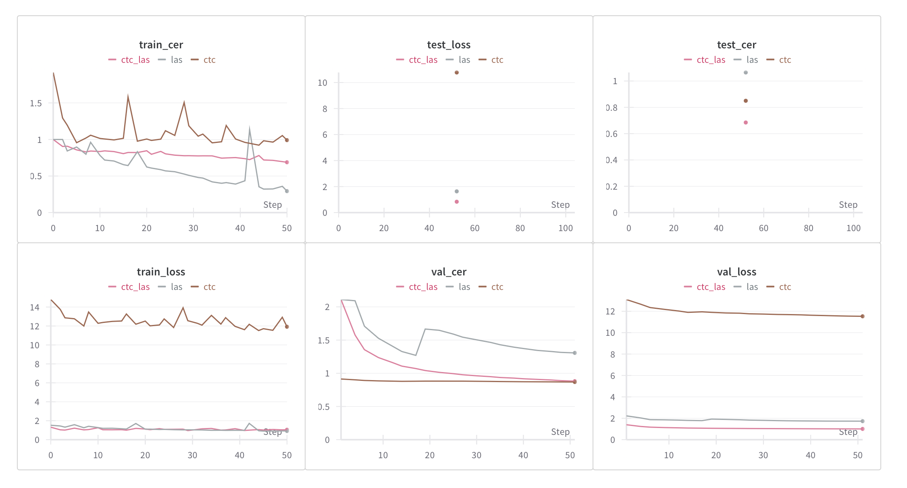

# END to END Automatic Speech Recognition

This is an implementation of 3 different end-to-end ASR architectures. 

Implementation was mostly done using Pytorch

The end-to-end ASR models are based on CTC[1](#Reference), Listen, Attend and Spell[2](#Reference)
and LAS-CTC[3](#Reference). 

The models were trained and tested on a subset of the HarperValleyBank Dataset[4](#Reference). Which is hosted [here](http://web.stanford.edu/class/cs224s/download/harpervalleybank.zip).
The dataset is used to train models which predicts each spoken character.
## Highlights
- Feature Extraction
    - Uses Librosa to extract wav log melspectrogram
    - Character encoding
- Training end-to-end ASR
    - Multiple implementation of ASR model architecture including attention based models
    - Regularization of attention-based network to respect CTC alignments (LAS-CTC)
    - Utilizes Lightning Trainer API
    - Training process logs and visualization with [Wandb](https://wandb.ai/site)
    - Teacher-forcing
- Decoding
  - Greedy decoding
  - imposes a CTC objective on the decoding
  - CTC-Rules
  
unzip harper_valley_bank_minified.zip in the data directory

## Model Run Report

Model run report obtained from Wandb

## Reference
1. [Connectionist Temporal Classification: Labelling Unsegmented Sequence Data with Recurrent Neural Networks](https://www.cs.toronto.edu/~graves/icml_2006.pdf), A Graves *et al*.
2. [Listen, Attend and Spell](https://arxiv.org/abs/1508.01211v2), W Chan *et al.*
3. [Joint CTC-Attention based End-to-End Speech Recognition using Multi-task Learning](https://arxiv.org/abs/1609.06773), S Kim *et al.*
4. [CS224S: Spoken Language Processing](https://web.stanford.edu/class/cs224s/)

